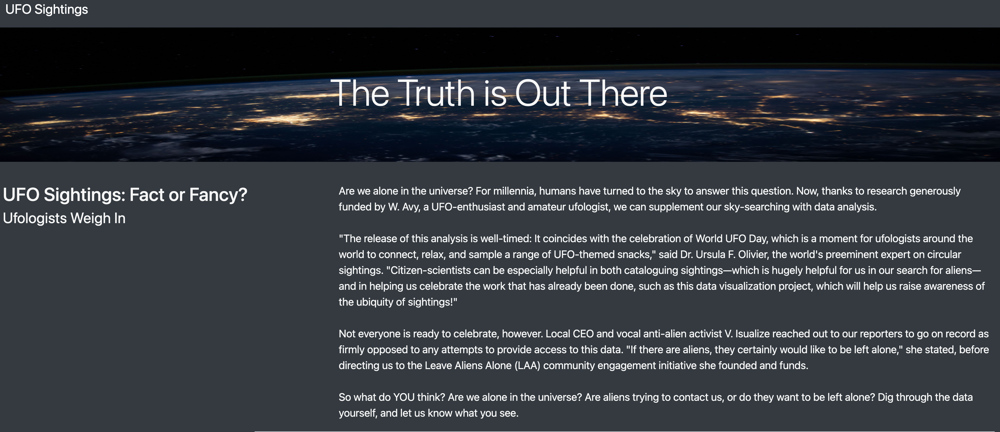
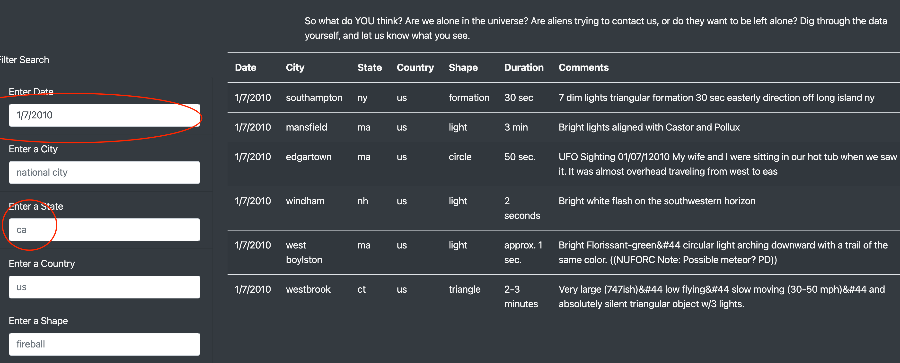
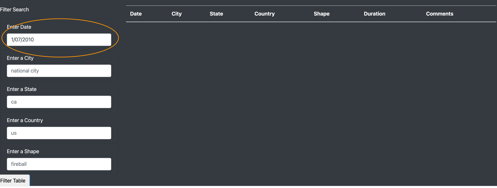

## UFOs

### Overview

The purpose of this project was to create a dynamic webpage for data on UFO Sightings. The filters include date, location, and shape. 

### Results

The figure above reflects the data fields used to filter UFO sightings. The table also has a multifilter feature as well allowing the user to drill down into the data. 

### Summary

One of the primary drawbacks to this page is the manual input into the data fields. For example, the date and state will not generate any results if the format is does not match the format. If "CA" was entered instead of "ca", there will be zero results even though the state is the same. Or if "1/07/10" was entered instead of '1/7/10" the filtering will not be the same even though it is the same date. 

I recommended having a drop down for the text fields and a click in calendar would optimize the filtering experience. Below is an example of how manual error can affect the results.

